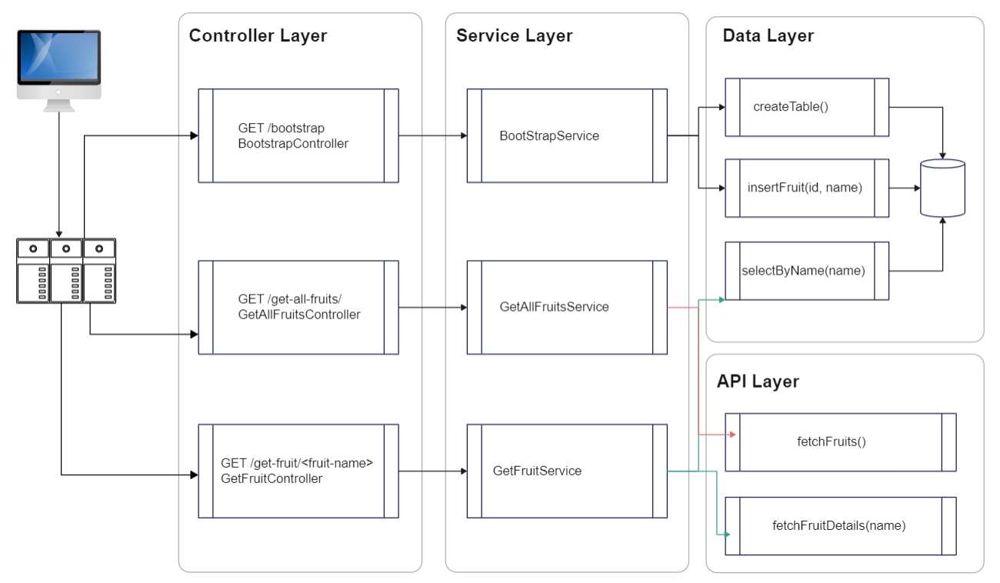

### Project Design Document: **Flask Web App for Fruit Information**



#### 1. **Project Overview**
This project is a Flask-based web application that interacts with the **Fruityvice API** to fetch and manage fruit data. It implements a three-layer architecture:
- **Controller Layer**: Defines the API endpoints and manages HTTP requests/responses.
- **Service Layer**: Handles business logic, data processing, and interaction with external APIs.
- **Data Layer**: Manages interactions with the local SQLite database for storing fruit information.

The app also has an API layer in extension to the three-layer architecture.
- **_(Extension)_ API  Layer**: Manages API calls using the `requests` library to other APIs.

The app provides three key functionalities:
1. Bootstrapping fruit data and storing it in a local SQLite database.
2. Fetching all fruits directly from the Fruityvice API.
3. Retrieving individual fruit information after validating it in the database.

#### 2. **Goals**
- Provide a simple API to fetch and store fruit data.
- Separate concerns across the Controller, Service, and Data layers for maintainability.
- Use SQLite for local data storage to cache fruit names and IDs.
- Fetch fresh data from Fruityvice API when needed.

#### 3. **System Architecture**
- **Controller Layer**: Handles HTTP requests and forwards them to the Service layer.
- **Service Layer**: Handles logic for:
  - Fetching and caching fruit data.
  - Validating data with the database.
  - Making external API calls.
- **Data Layer**: Responsible for creating and interacting with an SQLite database to store fruit information.
- **_(Extension)_ API  Layer**: Manages API calls using the `requests` library to other APIs.

---

### 4. **API Endpoints**

#### **GET - /bootstrap**
- **Purpose**: Initializes the fruit database by fetching fruit data from the Fruityvice API and storing fruit names and IDs in a local SQLite table.
- **Workflow**:
  1. Controller invokes the `BootstrapService`.
  2. `BootstrapService` invokes the `fetchFruits()` call from the API layer, to retrieve all the fruits.
  3. The data is passed to the Data layer, where:
     - A table is created (if not already present).
     - Fruit names and IDs are stored in the database.
- **Service Involved**: `BootstrapService`
- **Data Layer Interaction**: 
    - Create table if not present.
    - Stores fruit names and IDs in the database.
- **API Layer Interaction**: Fetch all fruits.

#### **GET - /get-all-fruits**
- **Purpose**: Fetches all fruit data from the Fruityvice API and returns it to the client without any interaction with the database.
- **Workflow**:
  1. Controller invokes `GetAllFruitsService`.
  2. `GetAllFruitsService` invokes the 
  2. `GetAllFruitsService` calls the Fruityvice API using the `requests` library.
  3. The full list of fruits from Fruityvice API is returned to the client.
- **Service Involved**: `GetAllFruitsService`
- **Data Layer Interaction**: None.
- **API Layer Interaction**: Fetch all fruits.

#### **GET - /get-fruit/<fruit-name>**
- **Purpose**: Fetches details of a specific fruit after validating its existence in the database. If the fruit exists in the local database, the service fetches the full fruit information from Fruityvice API and returns it to the client.
- **Workflow**:
  1. Controller calls `GetFruitService` with `fruit-name` as a parameter.
  2. `GetFruitService` checks if the fruit exists in the SQLite database by querying the Data layer.
  3. If found, it fetches detailed fruit data from Fruityvice API, by calling `fetchFruitDetails(fruit_name)` through the API Layer and returns it to the client.
  4. If not found, an error message is returned.
- **Service Involved**: `GetFruitService`
- **Data Layer Interaction**: Checks if the fruit exists in the local database.
- **API Layer**: Fetch fruit details for a specific fruit.

---

### 5. **Layer Structure**

#### **Controller Layer** (Flask Routes)
- **Description**: Defines the HTTP routes that map to specific services.
- **Responsibility**: Handles HTTP requests and passes data to the Service layer.
- **Routes**:
  - `GET /bootstrap`: Calls `BootstrapService`.
  - `GET /get-all-fruits`: Calls `GetAllFruitsService`.
  - `GET /get-fruit/<fruit-name>`: Calls `GetFruitService` with `fruit-name`.

#### **Service Layer**
- **Description**: Contains the core business logic and makes external API calls.
- **Responsibility**: Implements logic for:
  - Get fruit data via the API layer.
  - Storing and validating fruit information via the Data layer.
- **Services**:
  - **`BootstrapService`**: 
    - Fetches fruit data and stores it in the SQLite database.
        - Calls `createTable()` via data layer
        - Calls `fetchFruits()` via API layer
        - Calls `insertFruit(id, name)` via data layer
  - **`GetAllFruitsService`**:
    - Fetches all fruits from Fruityvice API.
        - Calls `fetchFruits()` via API layer
  - **`GetFruitService`**:
    - Checks if the fruit exists in the database.
    - If exists, fetches its details from Fruityvice API.
        - Calls `selectByName(name)` via data layer
        - Calls `fetchFruitDetails(name)` via API layer.

#### **Data Layer**
- **Description**: Manages the SQLite database for fruit storage.
- **Responsibility**: Handles CRUD operations for the fruit table.
- **Operations**:
  - `createTable()` - Create the `fruits` table.
  - `insertFruit(id, name)` - Insert fruit name and ID during bootstrapping.
  - `selectByName(name)` - Query the database to check if a fruit exists.

#### **API Layer**
- **Description**: Manages fetch API calls to the [fruityvice.com](https://www.fruityvice.com/) API.
- **Responsibility**: Makes fetch calls to get all fruits and specific fruit data.
- **Operations**:
    - `fetchFruits()` - Fetch all fruits _(Check fruityvice documentation)_
    - `fetchFruitDetails(name)` - Fetch one specific fruit _(Check fruityvice documentation)_

---

### 6. **Database Schema**

#### Table: `fruits`
- **Columns**:
  - `id` (INTEGER): The fruit's unique ID.
  - `name` (TEXT): The name of the fruit.
  
- **SQL Queries**:
  - **Create Table**:
    ```sql
    CREATE TABLE IF NOT EXISTS fruits (
      id INTEGER PRIMARY KEY,
      name TEXT NOT NULL
    );
    ```
  - **Insert Data**:
    ```sql
    INSERT INTO fruits (id, name) VALUES (?, ?);
    ```
  - **Select by Name**:
    ```sql
    SELECT * FROM fruits WHERE name = ?;
    ```

---

### 7. **External Dependencies**
- **Fruityvice API**: Provides the data for fruits.
    - Docs: [https://www.fruityvice.com/doc/index.html](https://www.fruityvice.com/doc/index.html)
    - API: [https://www.fruityvice.com/api/fruit/all](https://www.fruityvice.com/api/fruit/all)
- **Libraries**:
  - `Flask`: For creating the web application and routing.
  - `requests`: For making API calls to Fruityvice.
  - `sqlite3`: For interacting with the SQLite database.

---

### 8. **(Optional) Error Handling**
- **Database Errors**: If there is an issue with the database (e.g., connection issues), appropriate error messages should be logged and returned.
- **API Errors**: Handle errors from Fruityvice API (e.g., invalid API responses or fruit not found) and return a meaningful message to the user.
- **Validation**: The service layer ensures that requests for individual fruits are validated by checking their presence in the local database before making an API call.

---

### 9. **(Optional) Testing**
- **Unit Testing**:
  - Test each service in isolation to ensure they function as expected.
  - Use mock API responses for testing Fruityvice API interactions.
- **Integration Testing**:
  - Test the full flow, from the Controller to the Service and Data layers.
  - Test database operations, ensuring fruits are inserted and queried correctly.

--- 

### 11. **Conclusion**
This project demonstrates a clean, layered architecture for building a web app that interacts with external APIs and manages local data storage. The design separates concerns and ensures maintainability, scalability, and testability.